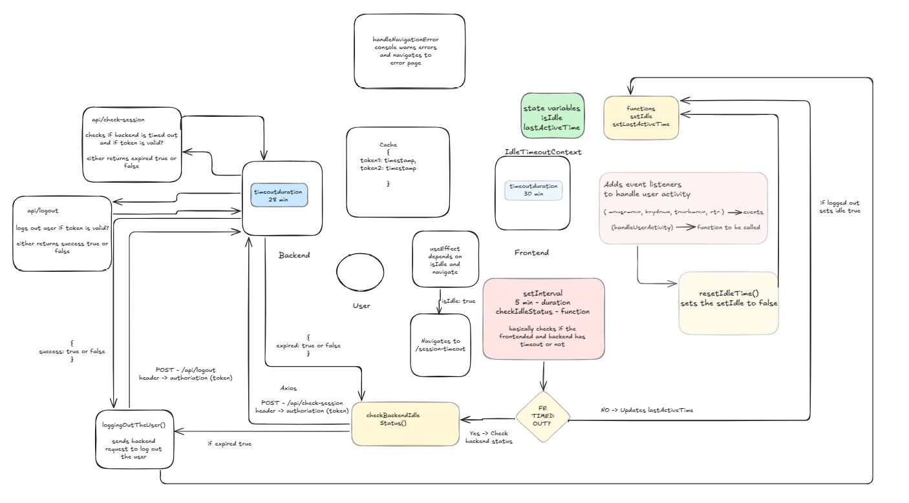

# Backend for Session Management



## Overview
This is the backend for handling user sessions with features like login, session check, and session timeout. The backend utilizes Express.js for routing, NodeCache for session storage, and CORS middleware to allow cross-origin requests from the frontend.

## Features
- **Login**: Authenticates users by storing session information in the cache.
- **Session Check**: Verifies if the user's session is active or expired.
- **Logout**: Logs out the user and invalidates their session.
- CORS enabled for frontend communication.

## Technologies Used
- **Node.js**: JavaScript runtime
- **Node-cache**: In-memory caching
- **Express.js**: Web framework for Node.js
- **CORS**: Cross-Origin Resource Sharing

## Requirements
- Have NodeJs installed.

## Installation

## Running Backend Locally

1. Clone the repository:

```bash
git clone https://github.com/Pareen-Kunia/DiDum.git
```
2. Navigate to backend
   
```bash
cd backend
```
3. Create a env file with backend timeout duration 
Example :
```markdown
REACT_BACKEND_TIMEOUT=40000
```

4. Install dependencies:
```bash
npm install
```

5. Start the local development server
```bash
npm run start
```
or

```bash
node server.js
```
The server will run on port 3001 by default.

## Endpoints

### `GET /`
Returns a simple hello message to verify the server is running.
```json
{
  "message": "Hello"
}
```

### `POST /api/login`
Logs in the user by storing the session token in memory. 
Headers: 
- Authorization: Required token for session.
Format 'Bearer <token>'

### Response:

- **200 OK**: 
```json
{
  "message": "Login successful"
}
```

- **400 Bad request**: 
```json
{
  "error": "Authorization token is required"
}
```

- **500 Internal Server Error**: 
```json
{
  "error": "Failed to store session in cache"
}
```

### `GET /api/get-cache`
Returns the session stored in the cache for a given token. 
Headers: 
- Authorization: Required token for session.
Format 'Bearer <token>'

### Response:

- **200 OK**: 
```json
{
 "message": "done successfully!"
}
```

- **500 Internal Server Error**: 
```json
{
  "message": "Error occurred"
}
```

### `POST /api/check-session`
Checks whether the user's session is still valid or expired.
Headers: 
- Authorization: Required token for session.
Format 'Bearer <token>'

### Response:

- **200 OK**: 
```json
{
  "expired": false, 
  "message": "Session active" 
}
```
if the session is still valid.

- **400 Bad request**: 
```json
{
  "error": "Authorization token is required"
}
```

- **500 Internal Server Error**: 
```json
{
  "error": "Internal server error"
}
```

### `POST /api/logout`
Logs the user out by removing their session.
Headers: 
- Authorization: Required token for session.
Format 'Bearer <token>'

### Response:

- **200 OK**: 
```json
{
  "success": true, 
  "message": "Logout successful"
}
```
if the session is still valid.

- **400 Bad request**: 
```json
{
  "error": "Authorization token is required"
}
```

- **500 Internal Server Error**: 
```json
{
  "error": "Internal server error"
}
```

### Error Handling
Any invalid route will return a 404 Not Found error with the following response:

### Response:

```json
{
  "error": "Endpoint not found"
}
```

### Cache Configuration

The cache is managed using node-cache. It stores session tokens with a TTL (time-to-live) of 2700 seconds (45 minutes). The cache is checked every 2400 seconds (40 minutes). Sessions are considered expired if they exceed the defined timeout (set via REACT_BACKEND_TIMEOUT).

### Environment Variable Configuration

Make sure to create a .env file. Refer the .env.sample file for reference
```bash
.env 
REACT_APP_TIMEOUT=YOUR-BACKEND-TIMEOUT-DURATION
PORT=YOUR-BACKEND-PORT
REACT_FRONTEND_URL=YOUR-FRONTEND-URL
```


